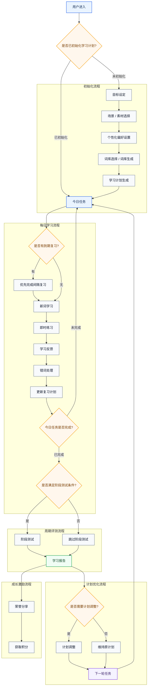
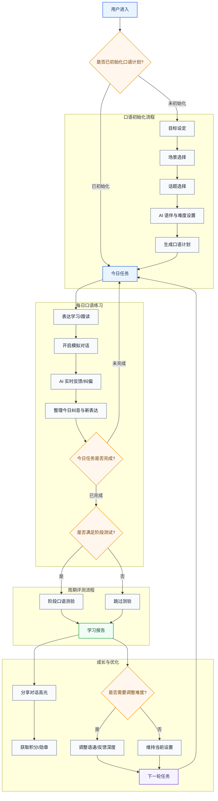
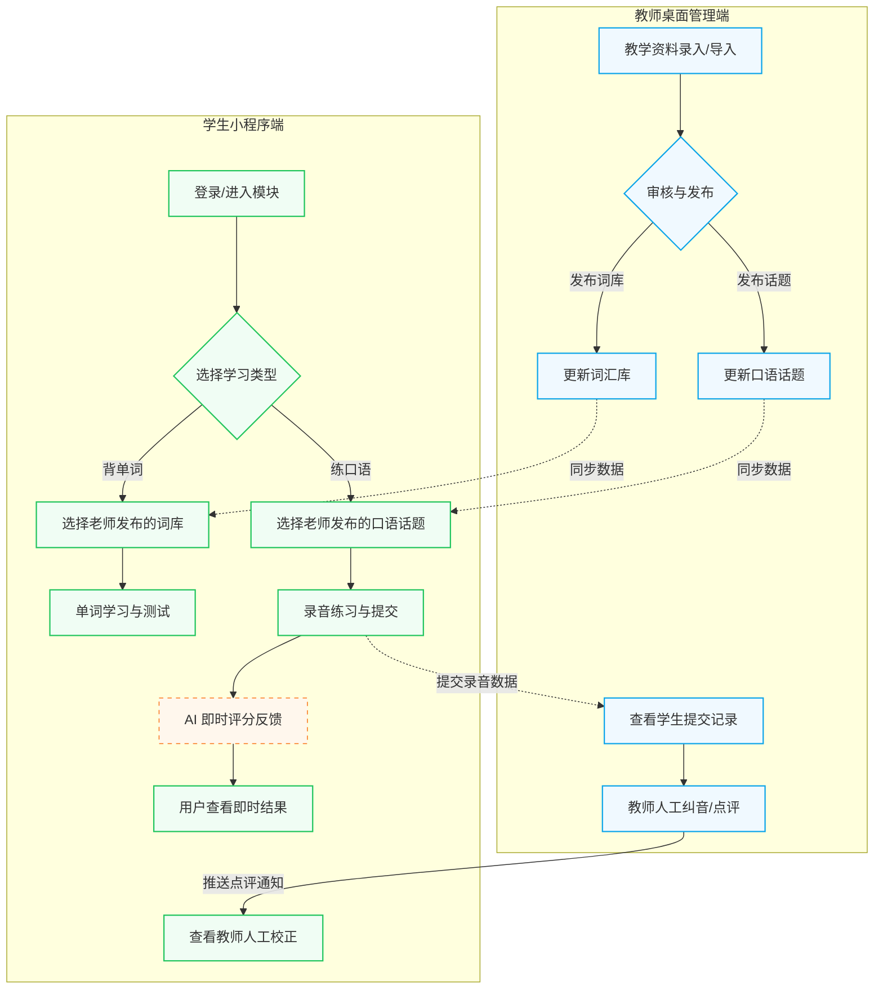
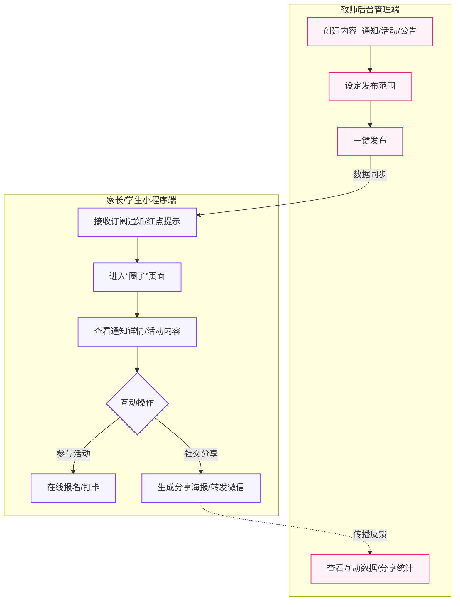

# 词汇学习系统设计流程图

### 系统设计

任务驱动 × 场景承载 × 学习对象 × 记忆算法 × 学习反馈 × 评测分析


## 背单词系统整体流程

| 核心理念 | 对应流程                   |
| ---- | ---------------------- |
| 任务驱动 | 目标设定、学习计划生成、今日任务、下一轮任务 |
| 场景承载 | 场景 / 素材选择              |
| 学习对象 | 词库选择、新词学习、错词处理         |
| 记忆算法 | 间隔复习                   |
| 学习反馈 | 即时练习、错词处理、学习报告         |
| 评测分析 | 阶段测试、学习报告、计划调整         |

```
用户进入
→ 目标设定
→ 场景 / 素材选择
→ 词库选择
→ 个性化偏好设置
→ 学习计划生成
→ 今日任务
→ 新词学习
→ 即时练习
→ 错词处理
→ 间隔复习
→ 阶段测试
→ 学习报告
  → 荣誉分享
  → 获取积分
→ 计划调整
→ 下一轮任务
```


### 核心流程

#### 1. 入口判断

用户进入
→ 判断是否已初始化学习计划

- 已初始化 → 进入今日任务
- 未初始化 → 进入初始化流程

#### 2. 初始化流程

目标设定
→ 场景 / 素材选择
→ 个性化偏好设置
→ 词库选择 / 词库生成
→ 学习计划生成
→ 今日任务

#### 3. 每日学习流程

今日任务
→ 判断是否有到期复习

- 有 → 优先完成间隔复习
- 无 → 进入新词学习

新词学习
→ 即时练习
→ 学习反馈
→ 错词处理
→ 更新复习计划
→ 今日任务完成判断

#### 4. 周期评测流程

判断是否满足阶段测试条件

- 是 → 阶段测试
- 否 → 跳过

→ 学习报告

#### 5. 成长激励流程

学习报告
→ 荣誉分享
→ 获取积分

#### 6. 计划优化流程

学习报告
→ 判断是否需要计划调整

- 是 → 计划调整
- 否 → 维持原计划

→ 下一轮任务

### Mermaid 流程图




### 第一阶段设计
> 采用 “固定选项 + 少量自定义” 的方式。
> 以目标设定建立任务方向，以场景选择承载学习用途，以词库选择确定学习对象，以个性化偏好生成每日计划，以新词学习和即时练习完成输入与验证，以错词和间隔复习形成记忆闭环，以学习报告、荣誉分享和积分机制增强反馈与持续动力，最终根据表现调整下一轮任务。

```
目标设定：我为什么学
场景选择：我在哪里用
词库选择：我学哪些词
偏好设置：我每天怎么学
计划生成：系统帮我安排
今日任务：我今天做什么
学习反馈：我哪里做得好 / 不好
荣誉积分：我完成后得到什么
计划调整：明天怎么继续
```


#### 阶段 1：进入模块

##### 目标
判断用户是否已经完成初始化。

##### 页面状态
用户进入背单词模块后，系统判断：是否已有有效学习计划？

##### 判断逻辑
| 条件          | 流向     |
| ----------- | ------ |
| 没有学习计划      | 进入目标设定 |
| 已有学习计划      | 进入今日任务 |
| 有计划但未完成词库选择 | 回到词库选择 |
| 有计划但今日任务未生成 | 生成今日任务 |
| 有未完成任务      | 继续上次学习 |


##### 模块的入口
- 主页的单词学习入口


#### 阶段 2：目标设定

##### 目标
我为什么要背单词？这是任务驱动的起点。

##### 第一阶段目标选项
| 目标类型 | 选项名称  | 适合用户             |
| ---- | ----- | ---------------- |
| 出国考试 | 雅思学习  | IELTS 备考用户       |
| 出国考试 | 托福学习  | TOEFL 备考用户       |
| 国内考试 | 四六级学习 | CET-4 / CET-6 用户 |
| 国内考试 | 考研英语  | 考研用户             |
| 职场应用 | 商务英语  | 工作沟通、邮件、会议       |
| 日常提升 | 日常英语  | 生活交流、旅行表达        |
| 自定义  | 自定义目标 | 自己导入词库或自由学习      |

##### 页面推荐设计
你想通过背单词达成什么目标？

选项卡: 单选
```
雅思学习
适合准备 IELTS 考试，重点覆盖学术阅读、听力和写作高频词。

托福学习
适合准备 TOEFL 考试，重点覆盖学术场景和校园场景词汇。

四六级学习
适合大学英语四六级备考，重点覆盖高频考试词汇。

考研英语
适合考研阅读、翻译和写作词汇积累。

商务英语
适合职场会议、邮件、汇报和商务沟通。

日常英语
适合日常交流、旅行、生活表达。

自定义目标
适合自己上传词库或自由安排学习。
```


#### 阶段 3：场景选择

##### 目标
这些词未来主要用在哪里？这是“场景承载”的核心。

##### 第一阶段场景选项: 单选
| 场景    | 说明                |
| ----- | ----------------- | 
| 考试高频  | 高频考试词、阅读常见词、题目常见词 | 
| 学术阅读  | 论文、教材、学术文章中的词汇    | 
| 生活交流  | 日常聊天、旅行、购物、社交     | 
| 商务沟通  | 邮件、会议、汇报、谈判       | 
| 影视听力  | 影视剧、播客、视频内容中的常见词  | 
| 自定义场景 | 用户自己定义学习用途        | 


##### 页面推荐设计
你希望这些单词主要用于什么场景？

选项文案：
```
考试高频
优先学习考试中最常见、最容易反复出现的核心词。

学术阅读
适合阅读论文、教材、学术文章和长篇阅读材料。

生活交流
适合日常表达、旅行、社交和基础沟通。

商务沟通
适合邮件、会议、汇报、谈判和职场表达。

影视听力
适合看剧、听播客、看视频时理解常见表达。

自定义场景
根据自己的学习材料或目标创建专属场景。
```


#### 阶段 4：素材 / 词库选择

##### 目标
我从哪里学这些词？

##### 第一阶段场景选项: 单选
| 素材来源    | 说明                            |
| ------- | ----------------------------- |
| 雅思核心词库  |  覆盖 IELTS 阅读、听力、写作中常见高频词。       |
| 托福核心词库  | 覆盖 TOEFL 学术讲座、阅读和校园对话中的高频词。    |
| 四六级核心词库  | 覆盖大学英语四六级高频核心词。     |
| 考研核心词库 |  覆盖考研阅读、翻译和写作中常见重点词。         |
| 商务英语核心词库 |  覆盖邮件、会议、汇报、谈判中的高频商务表达。 |


##### 页面推荐设计
选择你的学习词库

选项文案：
```
系统为你推荐：
[雅思核心词库] 推荐理由：与你的目标和场景匹配

其他可选词库：
[托福核心词库]
[四六级核心词库]
[考研核心词库]
[商务高频词库]
```

每个词库卡片显示：
- 词库名称
- 适用目标
- 单词数量
- 难度
- 预计完成时间
- 推荐理由


#### 阶段 5：个性化偏好设置

##### 目标
我现在什么水平？希望多久完成？每天能学多少？

##### 第一阶段场景选项: 

1. 当前水平

选项：
| 水平 | 说明              |
| -- | --------------- |
| 入门 | 很多基础词还不熟        |
| 基础 | 认识常见词，但词汇量不稳定   |
| 进阶 | 有一定词汇量，希望系统巩固提升 |
| 冲刺 | 临近考试，需要高强度复习    |

2. 期待完成时间

| 完成时间 | 适合用户        |
| ---- | ----------- |
| 30 天 | 冲刺型，高强度     |
| 60 天 | 标准型，适合大多数用户 |
| 90 天 | 稳定型，压力较小    |
| 自定义  | 用户自己设置日期    |

3. 每日学习时间

| 时间/天 | 说明              |
| ----- | --------------- |
| 10 分钟 | 碎片时间        |
| 20 分钟 | 标准时间        |
| 30 分钟 | 深度学习        |
| 自定义  | 用户自己设置时间    |

4. 练习偏好
| 偏好   | 系统影响       |
| ---- | ---------- |
| 记忆优先 | 增加识别题和复习频率 |
| 拼写优先 | 增加拼写输入题    |
| 听力优先 | 增加听音选词题    |
| 例句优先 | 增加例句填空题    |


##### 页面推荐设计
> 设置你的学习节奏

```
当前水平：入门 / 基础 / 进阶 / 冲刺

期待完成时间：30 天 / 60 天 / 90 天 / 自定义

每日学习时间：10分钟 / 20分钟 / 30分钟 / 自定义

练习偏好：记忆优先 / 拼写优先 / 听力优先 / 例句优先
```


#### 阶段 6：学习计划生成

##### 目标
系统根据前面的选择，生成一个可执行学习计划。

##### 处理

1. 输入: 基于之前的输入: 
- 目标
- 场景
- 词库
- 个性化偏好设置: 当前水平、期待完成时间、每日学习时间、练习偏好


2. 输出:学习计划页应该展示：

```
目标：雅思学习
场景：考试高频 + 学术阅读
词库：雅思核心词库
计划周期：60 天
每日新词：20 个
每日复习：系统自动安排
练习偏好：考试优先 + 拼写强化
预计每日用时：20 分钟
阶段检查：每 7 天一次学习总结
```


##### 页面推荐设计

1. 先呈现之前的设置
- 目标
- 场景
- 词库
- 个性化偏好设置: 当前水平、期待完成时间、每日学习时间、练习偏好

2. 点击"确认计划, 生成学习计划"按钮, 或者点击"重新设置"按钮返回"目标设定"页面. 

3. 呈现Loading, 生成中

4. 生成学习计划后,用卡片呈现"学习计划页".
```
目标：雅思学习
场景：考试高频 + 学术阅读
词库：雅思核心词库
计划周期：60 天
每日新词：20 个
每日复习：系统自动安排
练习偏好：考试优先 + 拼写强化
预计每日用时：20 分钟
阶段检查：每 7 天一次学习总结
```


4. 点击"开始学习",进入"今日任务"页面. 或者"重新设置"按钮返回"目标设定"页面


#### 阶段 7：今日任务

##### 目标
让用户每天知道今天该做什么。

##### 今日任务组成

| 任务类型 | 是否必须 | 说明       |
| ---- | ---- | -------- |
| 今日新词 | 必须   | 按计划学习新词  |
| 今日复习 | 必须   | 根据间隔复习生成 |
| 错词强化 | 必须   | 自动安排错词   |
| 今日小结 | 必须   | 完成后生成报告  |

##### 业务处理逻辑：
1. 先复习
2. 再学新词
3. 处理错词
4. 看今日小结报告


##### 页面推荐设计

1. 今日任务展示

```
今日任务

新词学习：20 个 (已完成0%)
间隔复习：12 个 (已完成0%)
错词强化：5 个 (已完成0%)
预计用时：22 分钟

```


#### 阶段 8：新词学习

##### 目标
完成第一次认知。


##### 页面推荐设计

1. 单词卡片展示

```
单词
音标
发音
中文释义
英文释义
例句
例句翻译
场景标签
```

2. 用户操作

```
按钮选项:
- 认识, 点击后卡片右滑消失
- 模糊, 点击后卡片渐隐消失
- 不认识, 点击后卡片左滑消失
- 收藏, 点击后卡片右上角显示收藏图标

交互:
- 左滑: 不认识
- 右滑: 认识

```

#### 阶段 9：即时练习

##### 目标
验证用户是否初步掌握。

##### 交互逻辑

1. 题型选项
  
| 题型     | 作用   |
| ------ | ---- |
| 看英文选中文 | 识别能力 |
| 看中文选英文 | 反向回忆 |


2. 结果选项


| 结果   | 系统动作       |
| ---- | ---------- |
| 答对   | 增加掌握度      |
| 答错   | 降低掌握度，进入错词 |
| 超时   | 标记为模糊      |


##### 页面推荐设计

1. 单词卡片展示

```
根据题型进行单词卡片展示
```

2. 用户操作: 进行选择

```
根据选项, 进行结果展示(正确,错误). 
1). 出现改卡片的完全信息:
- 单词
- 音标
- 发音
- 中文释义
- 英文释义
- 例句
- 例句翻译
- 场景标签

2). 按钮: 下一个
```

3. 用户操作: 点击下一个

```
根据选项, 进行结果展示(正确,错误), 出现改卡片的完全信息:
单词
音标
发音
中文释义
英文释义
例句
例句翻译
场景标签
```


#### 阶段 10：错词处理

##### 目标
把错误转化为下一轮学习任务。


##### 业务处理逻辑

1. 错词来源: 
  
| 错误来源   | 判断方式    | 
| ------ | ------- |
| 新词学习    | 用户点击的不认识   | 
| 新词学习   | 用户点击的模糊 | 
| 即时练习 | 答错 | 
| 即时练习 | 超时 | 


2. 错词记录字段

```
单词
错误次数
错误类型
最近错误时间
当前掌握度
下次复习时间
是否已解决
```

3. 移出规则

```
连续答对 2 次 → 移出错词本
```


#### 阶段 11：间隔复习

##### 目标
对抗遗忘。

##### 业务逻辑规则

1. 复习规则:
   
| 情况       | 下次复习      |
| -------- | --------- |
| 新学后答对    | 明天复习      |
| 连续 2 次答对 | 3 天后复习    |
| 连续 3 次答对 | 7 天后复习    |
| 答错       | 今天稍后或明天复习 |
| 连续答错 2 次 | 回到新词学习    |
| 连续答对 4 次 | 标记已掌握     |

2. 今日复习生成条件
- nextReviewAt <= 今天
- 只要到期，就进入今日复习任务

#### 阶段 12：学习报告

##### 目标
让用户知道今天学得怎么样。


##### 业务逻辑规则

今日报告包含的数据:
```
今日任务名称 - 你的名字
连续学习时间
新学单词
复习单词
错词
正确率
已掌握
连续学习
获得积分
学习建议
```


##### 页面推荐设计

1. 弹出今日报告卡片

```
今日学习报告
今日任务名称 - 你的名字
你已连续学习: 22 天
新学单词：20 个
复习单词：12 个
错词：5 个
正确率：78%
已掌握：8 个
连续学习：3 天
获得积分：35 分
```

2. 点击反面按钮, 显示

```
学习建议
恭喜你完成今日任务！

你已连续学习 3 天，累计掌握 150 个单词。


3. 下方有分享按钮, 点击后分享


✅ 推荐建议：
- 正确率 < 60%: 明天建议减少新词，增加复习
- 错词数 > 30%: 建议先完成错词强化
- 拼写错误多: 建议增加拼写训练
- 连续完成 22 天: 建议保持当前计划

💡 学习小贴士：

尝试用英文描述这些单词的意思，而不是依赖中文翻译
每晚睡前复习 10 个单词，记忆效果翻倍
```

#### 阶段 13：荣誉分享

##### 目标
让用户知道今天学得怎么样。


##### 业务逻辑规则

荣誉分享触发条件:
- 完成今日任务


##### 页面推荐设计

分享卡片内容
```
我今天完成了英语词汇学习

新学单词：20 个
复习单词：12 个
正确率：86%
连续学习：5 天
获得徽章：今日完成

继续积累，明天更进一步
```


#### 阶段 14：获取积分

##### 目标
增强用户持续学习动力。


##### 业务逻辑规则

1.积分规则

| 行为          | 积分  |
| ----------- | --- |
| 完成今日新词      | +10 |
| 完成今日复习      | +10 |
| 完成错词强化      | +10 |
| 完成全部今日任务    | +20 |
| 连续学习 3 天    | +15 |
| 连续学习 7 天    | +40 |
| 今日正确率 ≥ 85% | +10 |
| 清空今日错词      | +10 |
| 分享学习成就卡     | +5  |

2. 每日积分上限
- 每日最多获得 80 分

3. 积分等级

| 等级         | 积分范围        |
| ---------- | ----------- |
| Lv.1 词汇新手  | 0 - 199     |
| Lv.2 稳定学习者 | 200 - 499   |
| Lv.3 词汇进阶者 | 500 - 999   |
| Lv.4 词汇达人  | 1000 - 1999 |
| Lv.5 高阶学习者 | 2000+       |


##### 页面推荐设计

1. 完成当日任务后, 弹出积分获取提示
```
今日任务完成！
获得积分：35 分
连续学习：3 天

```


2. 分享学习报告, 弹出积分获取提示

```
分享任务完成！
获得积分：20 分
```

#### 阶段 15：计划调整

##### 目标
根据用户表现调整下一轮任务。

##### 业务逻辑规则

1. 调整规则
   
| 条件            | 系统建议       |
| ------------- | ---------- |
| 正确率 < 60%     | 明日新词减少 50% |
| 正确率 60% - 75% | 明日新词减少 25% |
| 正确率 75% - 85% | 维持计划       |
| 正确率 > 85%     | 可维持或增加 10% |
| 错词比例 > 30%    | 增加错词强化     |
| 复习任务过多        | 暂停新增词一天    |
| 连续 3 天完成任务    | 给予提速建议     |

2. 算法在后台自动调整


  
##### 核心流程 
→ 用户进入背单词模块
→ 系统判断是否已有计划
→ 如果没有，进入目标设定
→ 选择学习目标
→ 选择学习场景
→ 选择词库
→ 设置水平、周期、强度和练习偏好
→ 系统生成学习计划
→ 用户确认计划
→ 进入今日任务
→ 先完成到期复习
→ 学习今日新词
→ 完成即时练习
→ 答错词进入错词本
→ 系统更新复习时间
→ 生成今日学习报告
→ 获得徽章和积分
→ 可生成学习分享卡
→ 系统给出明日计划调整建议
→ 生成下一轮任务


##### 配置表:
| 阶段    | 第一阶段实现内容      | 选项设计                              |
| ----- | ------------- | --------------------------------- |
| 进入模块  | 初始化判断         | 有计划 / 无计划 / 继续任务                  |
| 目标设定  | 学习目标选择        | 雅思、托福、四六级、考研、商务、日常、自定义            |
| 场景选择  | 学习场景选择        | 考试高频、学术阅读、生活交流、商务沟通、影视听力、自定义      |
| 素材/词库 | 词库选择          | 雅思、托福、四六级、考研、商务、日常、自定义            |
| 偏好设置  | 水平、周期、强度、练习偏好 | 入门/基础/进阶/冲刺；30/60/90天；轻量/标准/强化/冲刺 |
| 计划生成  | 生成学习计划        | 每日新词、预计时间、复习规则                    |
| 今日任务  | 每日学习控制台       | 新词、复习、错词、预计时间                     |
| 新词学习  | 单词卡片          | 单词、发音、释义、例句、场景标签                  |
| 即时练习  | 三类题型          | 英选中、中选英、拼写                        |
| 错词处理  | 自动错词本         | 错误次数、错误类型、复测                      |
| 间隔复习  | 简单复习算法        | 1天、3天、7天、答错重来                     |
| 学习报告  | 今日报告          | 新词、复习、错词、正确率、掌握词                  |
| 荣誉分享  | 成就卡片          | 今日完成、连续学习、高准确率、掌握词数               |
| 获取积分  | 简单积分          | 完成任务、复习、分享、连续学习                   |
| 计划调整  | 规则建议          | 减少新词、增加错词、维持计划                    |
| 下一轮任务 | 明日任务生成        | 根据计划和表现生成                         |

---

## 口语学习整体流程

| 核心理念 | 对应流程                   |
| ---- | ---------------------- |
| 任务驱动 | 目标设定、学习计划生成、今日任务、下一轮任务 |
| 场景承载 | 场景 / 素材选择              |
| 学习对象 | 话题选择、表达学习、纠音处理         |
| 记忆算法 | 间隔复习                   |
| 学习反馈 | 模拟对话、AI 纠偏、学习报告         |
| 评测分析 | 阶段测试、学习报告、计划调整         |

```
用户进入
→ 目标设定
→ 场景 / 素材选择
→ 话题选择
→ 个性化偏好设置
→ 学习计划生成
→ 今日任务
→ 表达学习
→ 模拟对话
→ AI 纠偏
→ 间隔复习
→ 阶段测试
→ 学习报告
  → 荣誉分享
  → 获取积分
→ 计划调整
→ 下一轮任务
```

### Mermaid 流程图 (口语)





### 阶段 1：进入模块 (口语)

#### 目标
判断用户是否已经完成口语初始化。

#### 判断逻辑
| 条件 | 流向 |
| ----------- | ------ |
| 没有口语计划 | 进入目标设定 |
| 已有口语计划 | 进入今日任务 |
| 有计划但未选话题 | 回到话题选择 |
| 有计划但今日任务未生成 | 生成今日任务 |
| 有未完成对话 | 继续模拟对话 |

### 阶段 2：目标设定 (口语)

#### 目标
明确口语学习的目的，驱动练习重点。

#### 选项设计
| 目标类型 | 选项名称 | 适合用户 |
| ---- | ----- | ---------------- |
| 出国考试 | 雅思口语 | IELTS 备考、流利度训练 |
| 出国考试 | 托福口语 | TOEFL 备考、学术表达 |
| 职场应用 | 商务面试 | 求职者、职场晋升 |
| 职场应用 | 会议汇报 | 职场沟通、演讲展示 |
| 日常提升 | 社交聊天 | 基础交流、生活社交 |
| 旅游英语 | 出境旅游 | 机场、酒店、购物场景 |
| 自定义 | 自定义话题 | 自由对话或指定材料 |

### 阶段 3：场景选择 (口语)

#### 目标
定义对话发生的真实环境，增强沉浸感。

#### 场景选项
| 场景 | 说明 |
| ----- | ----------------- | 
| 模拟考场 | 1:1 还原考试流程与压迫感 | 
| 职场会议 | 包含正式汇报、观点碰撞、QA环节 | 
| 社交聚会 | 碎步闲聊、自我介绍、情感表达 | 
| 商务接待 | 接机、正餐、项目介绍 | 
| 紧急状况 | 问路、就医、报失、申诉 | 
| 自定义场景 | 用户描述场景，AI 实时生成 | 

### 阶段 4：话题选择 (口语)

#### 目标
选择本次练习的具体内容单元。

#### 推荐设计
- 根据目标推荐 3 个热门话题（如：雅思 P2 话题）。
- 话题展示：封面图、难度、建议词汇量、预计时长。

### 阶段 5：个性化偏好设置 (口语)

#### 目标
定制 AI 语伴的反馈风格和难度。

#### 设置项
1. **AI 语伴设置**：性别、音色（英音/美音）、语速。
2. **对话难度**：
   - 入门：AI 语速慢，提供大量中文提示。
   - 基础：AI 语速正常，提供表达提示。
   - 进阶：AI 使用高级词汇，有观点追问。
   - 冲刺：全英环境，模拟考官严格打分。
3. **反馈模式**：
   - 即时纠错：每说一句 AI 立即反馈。
   - 沉浸对话：对话结束后给出完整建议。

### 阶段 6：学习计划生成 (口语)

#### 目标
系统生成包含表达积累与模拟对话的周期性计划。

#### 输出示例
```
目标：商务面试
场景：职场办公室
话题：个人背景与项目经验
周期：14 天
每日目标：掌握 3 个核心表达 + 1 场模拟对话
AI 设置：美音、标准语速
```

### 阶段 7：今日任务 (口语)

#### 目标
明确每日“输入+输出”的闭环。

#### 任务组成
| 任务类型 | 说明 |
| ---- | -------- |
| 表达输入 | 学习核心短语与常用句式 |
| 模拟对话 | 与 AI 进行角色扮演练习 |
| 纠音强化 | 针对错误发音进行专项训练 |
| 今日报告 | 汇总表达准确度与流利度 |

### 阶段 8：表达学习 (输入)

#### 目标
在对话前储备必要的“弹药”。

#### 学习内容
- **核心词汇/短语**：该话题下的高频表达。
- **句式模板**：如何开始、如何转折、如何总结。
- **音频跟读**：标准音频演示，用户录音跟读。

### 阶段 9：模拟对话 (输出)

#### 目标
在真实语境中进行实战。

#### 交互体验
1. **AI 开场**：根据场景发起对话。
2. **用户回答**：点击麦克风说话。
3. **辅助功能**：
   - 提示：显示推荐使用的表达。
   - 翻译：实时翻译 AI 的话。
   - 重说：不满意可以重新录音。

### 阶段 10：AI 纠偏与反馈

#### 目标
通过反馈实现快速迭代。

#### 反馈维度
| 维度 | 说明 |
| ---- | ---------- |
| 发音 | 检测元音、辅音、重音准确度 |
| 语法 | 实时纠正时态、单复数、介词错误 |
| 用词 | 建议更地道、更高级的近义词替换 |
| 流利度 | 分析停顿次数、语速波动 |

### 阶段 11：间隔复习 (表达)

#### 逻辑
针对对话中表现不佳的表达，自动进入复习池。

### 阶段 12：学习报告 (口语版)

#### 数据指标
- **对话时长**：本次练习持续时间。
- **有效输出**：说出的总单词数/句子数。
- **地道指数**：高级表达的使用频率。
- **改进建议**：本次表现最差的 3 个发音或语法点。

### 阶段 13：荣誉分享与积分

- 分享对话精彩片段。
- 获得“对话达人”、“地道表达者”等勋章。
- 根据对话轮次和准确度获取积分。

### 阶段 14：计划调整

- 连续表现优秀：建议开启“冲刺模式”（加速、增加生僻词）。
- 表达准确度低：增加“表达学习”的比重，减少对话长度。


---

## 教学管理互动流程 (背单词 & 口语)

### 业务逻辑说明
1. **资料前置**：学生小程序端看到的所有词库和口语话题，必须由教师在桌面管理端完成录入与审核发布。
2. **AI + 人工双重反馈**：口语练习中，学生获得 AI 的即时反馈以保证效率；教师在后台查看学生当日录音，进行二次精准人工校正，形成反馈闭环。

### Mermaid 流程图 (师生教学互动)



---

## 圈子社区互动流程 (通知 & 活动)

### 业务逻辑说明
1. **中心化发布**：由教师/机构在后台统一管理通知、活动、公告，确保信息的权威性。
2. **去中心化传播**：家长和学生在小程序端接收信息，并可将学习成就、活动详情通过微信等渠道进行二次分享，增强品牌曝光与社交激励。

### Mermaid 流程图 (圈子互动)


